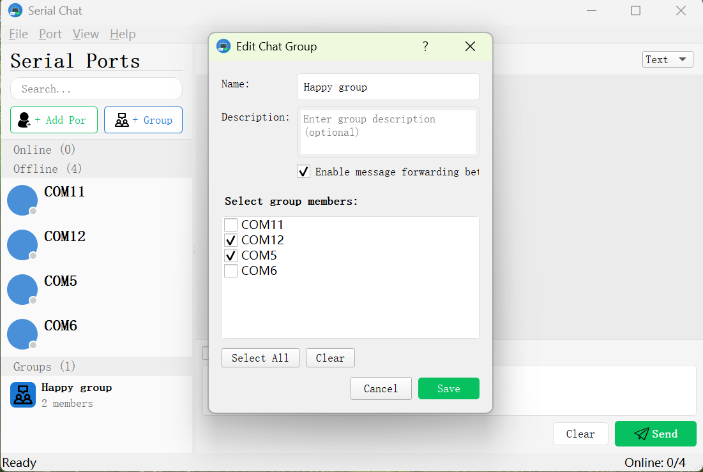

# Serial Chat - 串口聊天工具

<p align="center">
  <strong>一个具有聊天软件界面的串口通信工具</strong>
</p>

<p align="center">
  <a href="README.md">English</a>
</p>

## 概述

Serial Chat 是一个创新的串口通信工具，将传统的串口调试体验转变为类似社交软件的聊天界面。每个串口被视为一个"用户"，可以发送和接收消息，就像在聊天应用中一样。



## 功能特点

### 🔌 串口即用户
- 每个串口在好友列表中显示为一个"好友"
- 在线状态表示连接状态
- 离线串口保留并支持自定义备注

### 💬 聊天风格界面
- 消息以聊天气泡形式显示
- 发送的消息在右侧（绿色）
- 接收的消息在左侧（白色）
- 每条消息显示时间戳和端口名

### 👥 聊天群组
- 创建包含多个串口的自定义群组
- 群成员之间消息转发
- 监控不同设备之间的通信

### 📝 其他功能
- 文本和十六进制显示模式
- 串口自定义备注
- 好友列表和消息历史持久化
- 搜索功能
- 数据导出

## 界面预览

```
+------------------------------------------+
|  菜单栏                                   |
+------------------------------------------+
|          |                               |
|  好友    |     聊天区域                   |
|  列表    |  +-------------------------+  |
|          |  |  聊天气泡              |  |
|  在线    |  |  ...                    |  |
|  离线    |  +-------------------------+  |
|  群组    |  |  输入区域              |  |
|          |  +-------------------------+  |
+------------------------------------------+
|  状态栏                                   |
+------------------------------------------+
```

## 系统要求

- Qt 5.12 或 Qt 5.15
- CMake 3.14+
- 支持 C++17 的编译器
- Google Test（用于单元测试）

## 构建项目

### 克隆仓库

```bash
git clone https://github.com/yourusername/Serial-Chat.git
cd Serial-Chat
```

### 使用 CMake 构建

```bash
# 创建构建目录
mkdir build && cd build

# 配置
cmake .. -DCMAKE_PREFIX_PATH=/path/to/Qt

# 构建
cmake --build .

# 运行
./SerialChat
```

### 构建选项

| 选项 | 默认值 | 说明 |
|------|--------|------|
| `BUILD_TESTS` | ON | 构建单元测试 |

### 运行测试

```bash
cd build
ctest --output-on-failure

# 或直接运行
./SerialChat_tests
```

## 项目结构

```
Serial-Chat/
├── CMakeLists.txt          # CMake 配置
├── README.md               # 英文文档
├── README_CN.md            # 本文件
├── src/
│   ├── main.cpp            # 程序入口
│   ├── core/               # 核心业务逻辑
│   ├── models/             # 数据模型
│   ├── ui/                 # 用户界面组件
│   └── utils/              # 工具类
├── tests/                  # 单元测试
├── resources/              # 资源文件
└── docs/                   # 文档
```

## 使用说明

### 添加串口

1. 点击"添加串口"按钮
2. 选择端口并配置设置
3. 点击确定添加到好友列表

### 连接串口

1. 点击好友列表中的端口
2. 端口将自动连接
3. 绿色指示器表示在线状态

### 发送消息

1. 从好友列表选择一个端口
2. 在输入区域输入消息
3. 点击"发送"或按回车键
4. 切换"十六进制模式"发送十六进制数据

### 创建聊天群组

1. 点击"群组"按钮
2. 输入群组名称和描述
3. 选择至少2个成员
4. 启用"消息转发"在端口间转发消息
5. 点击"创建"

### 设置串口备注

1. 右键点击好友列表中的端口
2. 选择"设置备注"
3. 输入自定义名称

## 配置说明

### 串口设置

| 设置 | 选项 | 默认值 |
|------|------|--------|
| 波特率 | 1200 - 921600 | 115200 |
| 数据位 | 5, 6, 7, 8 | 8 |
| 停止位 | 1, 1.5, 2 | 1 |
| 校验位 | 无, 偶校验, 奇校验, 标记, 空格 | 无 |
| 流控制 | 无, 硬件, 软件 | 无 |

### 数据存储

应用数据存储位置：
- **Windows**: `%APPDATA%/SerialChat/`
- **macOS**: `~/Library/Application Support/SerialChat/`
- **Linux**: `~/.local/share/SerialChat/`

## 快捷键

| 快捷键 | 操作 |
|--------|------|
| F5 | 刷新端口列表 |
| Ctrl+N | 添加新端口 |
| Ctrl+Q | 退出 |
| Enter | 发送消息 |

## 开发文档

查看 [开发文档](docs/development.md) 了解：
- 架构概述
- 代码规范
- API 文档
- 测试指南

## 参与贡献

1. Fork 本仓库
2. 创建功能分支 (`git checkout -b feature/AmazingFeature`)
3. 提交更改 (`git commit -m 'Add some AmazingFeature'`)
4. 推送到分支 (`git push origin feature/AmazingFeature`)
5. 创建 Pull Request

## 许可证

本项目采用 MIT 许可证 - 查看 [LICENSE](LICENSE) 文件了解详情。

## 致谢

- Qt Framework 提供的优秀跨平台 GUI 工具包
- Google Test 提供的测试框架
